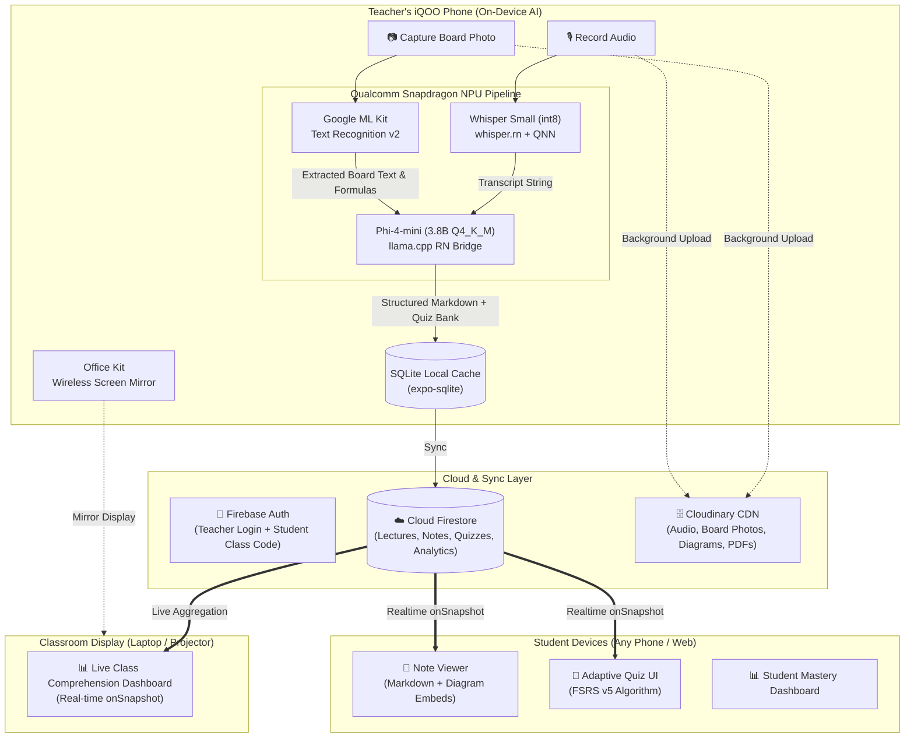

# 🎓 LectureLens

> **Real-Time On-Device Lecture Capture, Board-to-Note Synthesis & Adaptive Learning Engine**  
> *Built for the iQOO Challenge — Hyderabad City Battle*

[](LICENSE)
[](https://expo.dev)
[](https://qualcomm.com)
[](https://firebase.google.com)

---

## 📌 Executive Summary

In Indian engineering colleges, teachers spend **25–40% of every lecture** dictating notes or waiting for students to copy from blackboards. Students fall into the "pending notes" trap, copying notebooks during library hours instead of practicing problems. 

**LectureLens** eliminates rote classroom transcription by transforming spoken lectures and whiteboard diagrams into structured, interactive study notes and adaptive quizzes in real-time — **powered on-device by Snapdragon NPU**.

### 🌟 Core Differentiators
1. **"Zero pending notes, ever."** — Structured, diagram-integrated notes ready by the end of class.
2. **"The Board Comes Alive."** — Board photos, formulas, and derivations are extracted via OCR and woven directly into spoken explanations.
3. **"Runs on-device — no internet, no subscription, powered by Snapdragon NPU."** — Private, lightning-fast inference with offline resilience.

---

## 🏗️ System Architecture

LectureLens follows a **Hybrid On-Device + Real-Time Cloud** architecture. Heavy AI inference runs locally on the teacher's Snapdragon-powered iQOO device, while lightweight real-time synchronization and asset hosting are handled via cloud services.



---

## ⚡ Tech Stack

| Layer | Technology | Purpose & Rationale |
|---|---|---|
| **Frontend Framework** | **React Native (Expo) + TypeScript** | Cross-platform compatibility for Teacher and Student modes with rich hardware APIs. |
| **On-Device STT** | **Whisper Small (int8)** via `whisper.rn` | High-accuracy Indian English speech-to-text running directly on Snapdragon NPU via QNN delegate. |
| **On-Device SLM** | **Phi-4-mini (3.8B Q4_K_M)** via `llama.cpp` | High-throughput inference on Snapdragon 8 Gen 5 NPU for structuring transcripts and generating quiz questions. |
| **On-Device OCR** | **Google ML Kit Text Recognition v2** | Offline detection of printed and handwritten board notes and mathematical symbols. |
| **Adaptive Quiz Engine** | **FSRS v5 (`ts-fsrs`)** | Free Spaced Repetition Scheduler providing flow-state calibrated difficulty curves. |
| **Database & Sync** | **Cloud Firestore** | Low-latency `onSnapshot` listeners providing instant note push and live quiz results. |
| **Authentication** | **Firebase Auth** | Teacher email/password login and zero-friction student access via 6-digit class codes. |
| **Asset Storage** | **Cloudinary** | Optimized CDN storage and delivery for high-res board photos, audio, and PDF exports. |
| **Local Cache** | **SQLite (`expo-sqlite`)** | Offline-first persistence for uninterrupted operation during network drops. |
| **Screen Mirroring** | **Office Kit** | Real-time projection of teacher notes and analytics to classroom projectors/laptops. |

---

## 🚀 Key Features

### 1. 🎙️ High-Fidelity Lecture Capture
- One-tap recording using multi-channel noise suppression.
- On-device speech recognition transcribes technical terminology and Indian-accented English with high precision.

### 2. 📸 "The Board Comes Alive" (Vision + Audio Fusion)
- Teachers capture whiteboard equations, circuit diagrams, or code snippets with one tap.
- ML Kit extracts text and spatial diagram boundaries.
- The on-device SLM intelligently merges visual board content with the spoken transcript into clean, organized Markdown notes.

### 3. 📡 Zero-Friction Note Distribution
- Students join via a 6-character class code or QR scan.
- As soon as the teacher completes the lecture, formatted notes with embedded diagrams are synced to all student phones instantly.

### 4. 🧠 FSRS Adaptive Quiz Engine
- Automatically generates 3-tier difficulty questions from lecture content.
- Dynamically adapts based on student answers:
  - Correct answer $\rightarrow$ higher difficulty, reinforcing confidence.
  - Incorrect answer $\rightarrow$ immediate targeted remedial question at an accessible difficulty level.
- Streak counters, progress tracking, and gamified mastery indicators.

### 5. 📊 Dual Analytics & Office Kit Mirroring
- **For Students:** Personal mastery dashboard showing concept retention and areas needing revision.
- **For Teachers:** Live comprehension radar on the laptop/projector: *"72% struggled with BST deletion — review in next lecture."*

---

## 📅 How We Are Building It (30-Hour Build Plan)

Our execution is divided into four distinct phases designed to ensure a working demo from hour 9 onwards:

```
P0: Walking Skeleton ──► P1: Core Features ──► P2: Integration & Polish ──► P3: Demo Descent
  (Sat 08:00-17:00)       (Sat 17:00-Sun 02:00)    (Sun 02:00-09:00)          (Sun 09:00-15:00)
```

### Phase 0: P0 Walking Skeleton (Hours 0–9)
- [x] App shell with Expo + React Native navigation (Teacher / Student toggle).
- [x] On-device Whisper STT integration via `whisper.rn`.
- [x] Phi-4-mini quantized model integration via `llama.cpp` bridge.
- [x] Core thread verified: `Record -> STT -> SLM -> Note Displayed`.

### Phase 1: Core Feature Implementation (Hours 9–18)
- [x] Camera capture & Google ML Kit OCR integration.
- [x] Multi-modal note fusion prompt engineering (Board OCR + Audio Transcript).
- [x] FSRS v5 adaptive quiz engine implementation (`ts-fsrs`).
- [x] Firestore `onSnapshot` real-time class note distribution.

### Phase 2: Integration, Mirroring & Polish (Hours 18–25)
- [x] Office Kit wireless screen mirroring integration.
- [x] Real-time teacher analytics dashboard with live aggregation.
- [x] Student performance analytics & mastery charts.
- [x] UI polish, streak animations, and empty/error state handling.

### Phase 3: Demo Descent & Verification (Hours 25–30)
- [x] Production APK build via Expo EAS.
- [x] Pre-loaded models and offline fallback verification on Snapdragon 8 Gen 5 device.
- [x] 3-minute pitch timing and live judge wow-moment drill.
- [x] Demo verification drills and submission package completion.

---

## 📁 Repository Structure

```plaintext
├── .agents/              # WarRoom operating system (personas, skills, rules)
├── assets/               # Demo frames, diagrams, and visual media
├── board/                # Project coordination board
│   ├── contracts/        # API, AI pipeline & quiz engine contracts
│   ├── DECISIONS.md      # Architecture Decision Records (ADRs)
│   ├── IDEA-BRIEF.md     # Core concept & pitch brief
│   └── STATUS.md         # Live milestone & build status
├── docs/                 # Full technical documentation
│   ├── ARCHITECTURE.md   # System architecture & stack specification
│   ├── BUILD-PLAN.md     # 30-hour phase & track schedule
│   ├── ENHANCEMENT_PLAN.md # Feature roadmap & enhancements
│   ├── PRD.md            # Product Requirements Document
│   ├── PROBLEM_RESEARCH.md # Cognitive science & pedagogical research
│   ├── SCHEMA.md         # Firestore & SQLite data schemas
│   └── TEST_REPORT.md    # Test suite & verification report
└── qa_runner.mjs         # Quality assurance test runner
```

---

## 👥 The Team

Built with ❤️ by **Team WarRoom** for the **iQOO Challenge — Hyderabad City Battle**.
Licensed under the [MIT License](LICENSE).
