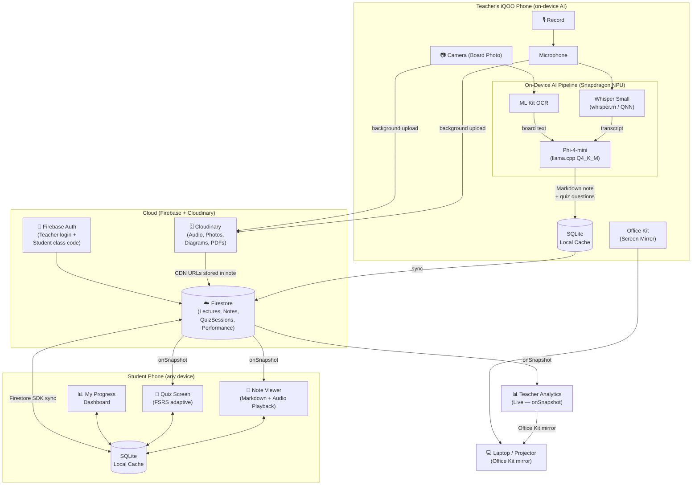

# Architecture — LectureLens (v2 — Online Pivot)

> DECISION #5 · 2026-09-21: Pivoted from fully offline to Hybrid Online.
> On-device AI (Whisper + SLM on NPU) retained as core differentiator.
> Cloud layer added for auth, real-time sync, file storage, and cross-device quiz access.

---

## 1 · Stack Decision Record

| Layer | Choice | Why | Rejected (and why it lost) |
|---|---|---|---|
| **Frontend** | React Native (Expo) + TypeScript | Cross-platform, single codebase for Teacher + Student modes, rich ecosystem for camera/audio/markdown | Native Android — faster NPU access but locks out multi-device support; Flutter — team JS preference |
| **Auth** | Firebase Authentication (email/password for teacher; anonymous + class-code join for students) | 30-minute setup, free tier unlimited MAU, handles teacher sessions + stateless student join with class code. No email needed for students. | Supabase Auth — good but unfamiliar to team; custom JWT — too much build time |
| **Realtime Database / Sync** | Firestore (Cloud Firestore) | `onSnapshot` listeners give live teacher dashboard — quiz results appear as students submit, zero polling. Offline-capable SDK handles flaky venue Wi-Fi gracefully. | MongoDB Atlas — no built-in realtime; Supabase Realtime — slightly less mature React Native SDK |
| **File Storage** | Cloudinary (audio recordings, board photos, generated diagrams, PDF note exports) | 25GB free tier (vs Firebase Storage 5GB). Built-in image optimization for board photos. Direct CDN URLs shareable to students. Auto PDF transforms for printable notes. | Firebase Storage — 5GB free limit too tight for audio; Backblaze B2 — no image transforms |
| **On-Device AI — STT** | Whisper Small (int8) via `whisper.rn` → QNN delegate on Snapdragon NPU | Best accuracy-vs-speed for Indian English. NPU offload keeps CPU free for UI. Unchanged from v1. | Cloud STT (Google/Deepgram) — adds latency, cost, internet dependency during recording |
| **On-Device AI — SLM** | Phi-4-mini (3.8B, Q4_K_M) via `llama.cpp` React Native bridge | Best instruction-following at this size; ~15-20 tok/s on Snapdragon 8 Gen 3. Note structuring + quiz generation stays on-device. Unchanged from v1. | Cloud LLM (GPT-4o/Gemini) — adds cost, latency, privacy concerns |
| **On-Device AI — OCR** | Google ML Kit Text Recognition v2 | Pre-installed, zero download, fully offline, handles printed + handwritten board text. Unchanged from v1. | Cloud Vision — violates on-device AI story |
| **Quiz Engine** | FSRS v5 (`ts-fsrs`) — runs locally, state synced to Firestore | Peer-reviewed spaced repetition. FSRS card state stored in Firestore so students get correct scheduling across devices. | SM-2 — less accurate; custom algo — unproven |
| **Local Cache** | SQLite via `expo-sqlite` | Offline-first cache. Firestore SDK syncs to it automatically. App works offline; syncs when connectivity returns. | AsyncStorage — no relational queries |
| **Deploy** | Expo EAS Build (APK) + Firebase Hosting (if web view needed) | APK on iQOO device for demo. Firebase project shared by all 3 builders via service account. | Play Store — review takes days |

### DECISIONS entry → `board/DECISIONS.md` #5

---

## 2 · The Walking Skeleton (P0 — unchanged thread, new transport)

The one thread that proves the core loop:

```
[Teacher Screen: Record button]
  → tap Record
  → microphone captures 30s of speech
  → whisper.rn transcribes audio on NPU → raw transcript string
  → Phi-4-mini structures transcript → Markdown note (on-device)
  → note saved to Firestore (cloud sync) + SQLite (local cache)
  → Cloudinary upload (audio + board photo, background)
  → Student opens app on ANY phone, enters class code
  → Firestore onSnapshot delivers note in real-time
  → Student sees rendered Markdown note
  → Student taps Quiz → FSRS question served from Firestore
  → Answer submitted → Firestore updated → Teacher dashboard updates live
```

**Skeleton deadline:** Saturday 17:00 IST (hour 9 of 30)

**Skeleton success criteria (all must pass):**
1. ✅ Teacher signs in with Firebase Auth
2. ✅ Student joins with class code (no email, no password)
3. ✅ Record → STT transcript appears (Whisper on NPU)
4. ✅ Transcript → Markdown note (SLM on-device)
5. ✅ Note synced to Firestore — student phone receives it via `onSnapshot`
6. ✅ Student taps Quiz → question appears → answer submitted → teacher dashboard updates live

---

## 3 · System Sketch



**Tracks derived:**

| Track | Scope |
|---|---|
| **FE** | React Native app shell, all screens (teacher + student), note renderer, quiz UI, dashboards, Office Kit trigger, audio player |
| **AI-Pipeline** | Whisper, ML Kit OCR, SLM prompt engineering, Cloudinary upload, note + quiz generation pipeline |
| **Quiz+Analytics** | FSRS engine, Firestore quiz session management, performance aggregation, live `onSnapshot` teacher dashboard, cross-device quiz history |

> **No separate `be` (backend) track.** Firebase + Cloudinary are BaaS — no custom server to write or host. All "backend" logic lives in Firestore security rules + Cloud Functions (if needed for aggregation — likely not in 6-day scope).

---

## 4 · Cross-Cutting Decisions

**Auth model:**
- Teacher: `createUserWithEmailAndPassword` → Firestore user doc with role: `teacher`
- Student: Enters 6-digit class code → app calls `signInAnonymously` → Firestore student doc with `{name, classCode, role: 'student'}` stored under the teacher's class
- Session persists: Student returns to any phone, re-enters class code → same anonymous UID via `linkWithCredential` or fresh session with merged history

**Offline behaviour:** Firestore SDK has built-in offline persistence. SQLite acts as secondary cache for AI pipeline outputs (audio path, raw transcript). App is fully usable offline for note viewing + quiz taking; syncs on reconnect.

**Realtime:** Firestore `onSnapshot` on:
- `classes/{classCode}/notes` → student gets new note instantly
- `classes/{classCode}/quizSessions` → teacher dashboard updates live

**Cloudinary upload:** Triggered after teacher taps Stop. Runs in background using `expo-file-system` + Cloudinary unsigned upload preset. Progress shown in teacher UI. CDN URLs written to Firestore note doc when upload completes.

**Audio playback:** Students access lecture audio via Cloudinary CDN URL stored in the Note document. `expo-av` plays it directly — no download needed.

**Feature flags:** `src/config/flags.ts`:
- `ENABLE_BOARD_OCR` — camera pipeline
- `ENABLE_QUIZ` — quiz engine
- `ENABLE_ANALYTICS` — dashboard
- `ENABLE_AUDIO_PLAYBACK` — Cloudinary audio player
- `ENABLE_QUIZ_HISTORY` — cross-device quiz history

**Env vars:** `EXPO_PUBLIC_FIREBASE_API_KEY`, `EXPO_PUBLIC_FIREBASE_PROJECT_ID`, `EXPO_PUBLIC_CLOUDINARY_CLOUD_NAME`, `EXPO_PUBLIC_CLOUDINARY_UPLOAD_PRESET` — all in `.env` (never committed).

---

## 5 · What We Are Explicitly NOT Building

| Not Building | Why |
|---|---|
| Custom REST API / Express server | Firebase + Cloudinary cover all backend needs. No server to write, host, or maintain. |
| User profile photos / avatars upload | Emoji avatar is sufficient for demo. Saves 2h. |
| Real-time streaming transcription (live captions) | Still on cut list. Post-process batch is demo-equivalent. Saves 4h. |
| Multi-class / school management panel | One teacher, one class per demo. Enterprise feature for v2. |
| Video recording / lecture replay | Audio + board photo is sufficient. Video = 10× storage cost on Cloudinary. |
| SMS OTP auth for students | Class code join is simpler, requires no phone number, works for minors. |
| Cloud AI inference | On-device NPU is the iQOO differentiator. Moving AI to cloud kills the core tech story. |
