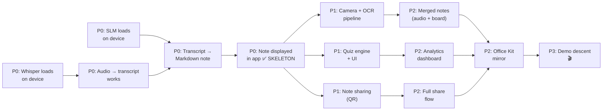

# Build Plan — LectureLens

> The grid the phase plans expand. Clock times are real datetimes (IST).
> Event: Sat 08:00 → Sun 17:00 (30h). Skeleton deadline: Sat 17:00 (hour 9).

## Phase × Track Grid

|  | **P0 Skeleton** (due Sat 17:00) | **P1 Core Features** (Sat 17:00 → Sun 02:00) | **P2 Integration + Polish** (Sun 02:00 → Sun 09:00) | **P3 Demo Descent** (Sun 09:00 → Sun 15:00) |
|---|---|---|---|---|
| **FE** | App shell (Expo + RN), Teacher screen with Record button, Student screen with note viewer (static Markdown), navigation (teacher/student mode toggle) | Camera capture UI, note sharing (QR display + scan), quiz UI (question → answer → result), dashboard scaffolding | Office Kit integration (screen mirror trigger), dashboard charts, animations (streak fire, confetti), edge states (loading, error, empty) | Demo polish: hardcoded demo flow, transitions, branded splash, final seed data |
| **AI-Pipeline** | Whisper integration (`whisper.rn` → test with 30s audio clip → transcript output), SLM loading (Phi-4-mini Q4_K_M → test with hardcoded transcript → Markdown output) | ML Kit OCR integration, SLM prompt engineering (transcript + board text → merged notes), quiz question generation prompt, pipeline orchestration (Record→STT→OCR→SLM→save) | Pipeline optimization (parallel OCR + STT), error recovery, model preloading at app start, latency tuning (<10s for wow moment) | Demo prep: pre-warm models, test on iQOO device, fallback to pre-generated output if model fails |
| **Quiz+Analytics** | FSRS engine core (`ts-fsrs` integration), `startQuizSession` + `submitAnswer` with hardcoded questions, 3-tier difficulty enum | Flow-state ramping logic, `generateQuizQuestions` (SLM prompt → parse → validate), Performance table updates, `getStudentPerformance` | `getClassAnalytics`, topic gap detection, streak tracking, dashboard data aggregation | Seed quiz data for demo, verify adaptive behavior on demo path |
| **Ship** | Expo dev build on iQOO device, models loaded on device, verify skeleton runs in airplane mode | — | EAS build (debug APK), smoke test full flow on device | Final APK, backup APK on USB, demo rehearsal ×3, video recording backup |

## Phase Timing (absolute IST)

| Phase | Start | End | Hours | Focus |
|---|---|---|---|---|
| **P0 — Skeleton** | Sat 08:00 | Sat 17:00 | 9h | Walking skeleton: Record→STT→SLM→Note displayed. Must work on device, airplane mode. |
| **P1 — Core** | Sat 17:00 | Sun 02:00 | 9h | Camera/OCR, note sharing, quiz UI + engine, all MUST items functional |
| **P2 — Integration** | Sun 02:00 | Sun 09:00 | 7h | Wire everything together, Office Kit, polish, analytics dashboard |
| **P3 — Descent** | Sun 09:00 | Sun 15:00 | 6h | Demo script, rehearsal, video, submission, deploy freeze |

## Load Ledger

| Builder | Declared Hours | Card Hours (≤70%) | Track(s) | Notes |
|---|---|---|---|---|
| **Builder 1 (Nova)** | 30h | 21h | FE | App shell, all screens, note renderer, quiz UI, dashboard, Office Kit UI |
| **Builder 2 (Sage)** | 30h | 21h | AI-Pipeline | Whisper, SLM, OCR, prompt engineering, pipeline orchestration |
| **Builder 3 (Forge)** | 30h | 21h | Quiz+Analytics + Ship | FSRS engine, quiz logic, analytics, build/deploy, demo prep |

> **30% buffer (9h per person)** absorbs: debugging on-device AI issues, model tuning, demo rehearsal, sleep.

## Deploy Targets

| Surface | Target | URL/Path |
|---|---|---|
| **App** | APK sideloaded on iQOO device | `file:///sdcard/LectureLens.apk` |
| **Models** | Pre-loaded on device storage | `/data/data/com.lecturelens/models/` |
| **Demo device** | iQOO flagship (Snapdragon 8 Gen 3) | Physical device at venue |
| **Laptop** | Office Kit mirror target | Any laptop with Office Kit receiver |

> No cloud deploy. No URLs. The phone IS the server.

## Integration Moments (Train Departures)

| # | What | When | Gate |
|---|---|---|---|
| 1 | **Skeleton assembly** | Sat 17:00 | Record→STT→SLM→Note on device, airplane mode. All 3 builders merge to `main`. |
| 2 | **End of P1 — Core merge** | Sun 02:00 | Camera+OCR pipeline working. Quiz flow functional. Note sharing via QR works between 2 phones. |
| 3 | **P2 — Integration smoke** | Sun 09:00 | Full demo flow runs end-to-end: Record→Board photo→Notes with diagram→Share→Quiz→Dashboard→Office Kit mirror. |
| 4 | **Final train — Feature freeze** | Sun 12:00 (T-5h) | No new features. Only bug fixes + demo polish. APK built and tested. |

## Freeze Calendar (from STATUS.md — enforced)

| Milestone | Absolute Time | Gate |
|---|---|---|
| Skeleton walking | Sat 17:00 | Core loop works on device |
| Endgame tiering active | Sun 05:00 | Start classifying remaining work as tier-1/2/3 |
| Video scripted | Sun 09:00 | Demo script finalized |
| Risky-feature freeze | Sun 10:00 | No new risky features (camera pipeline, model changes) |
| Video recorded | Sun 11:00 | Backup demo video in the can |
| Feature freeze | Sun 12:00 | No new features, period |
| Submission live | Sun 13:00 | All submission artifacts uploaded |
| Deploy freeze | Sun 13:30 | APK locked, no more builds |
| Demo rehearsal | Sun 14:00–15:00 | Full rehearsal with timing |
| Judging begins | Sun ~15:00 | 🎤 |

## Critical Path (what blocks what)

> **The first domino is model loading.** If Whisper or Phi-4-mini fails to load on the iQOO device by Sat 12:00 (hour 4), trigger `/pivot` — fall back to smaller models or pre-computed outputs.

## Risk Checkpoints

| Hour | Check | If Red |
|---|---|---|
| Sat 12:00 (h4) | Models load on device? | Pivot to smaller models (Whisper Tiny, Gemma-2B) |
| Sat 14:00 (h6) | STT produces readable transcript? | Add SLM post-processing cleanup step |
| Sat 17:00 (h9) | **SKELETON WALKS?** | If no: all hands on skeleton, cut camera pipeline |
| Sun 02:00 (h18) | Camera + Quiz both working? | Cut whichever is behind; preserve the other |
| Sun 09:00 (h25) | Full demo flow works? | Freeze features, polish what exists |
| Sun 12:00 (h28) | APK stable? | Ship what works, no more changes |
