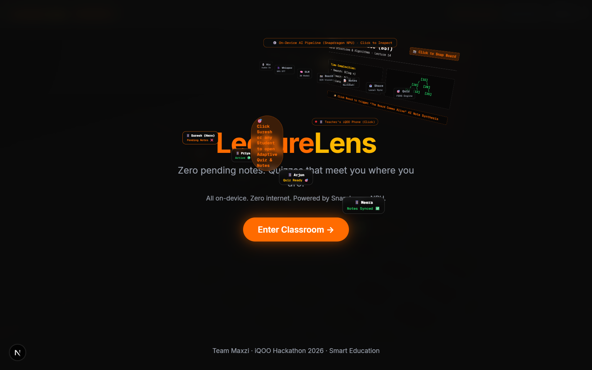
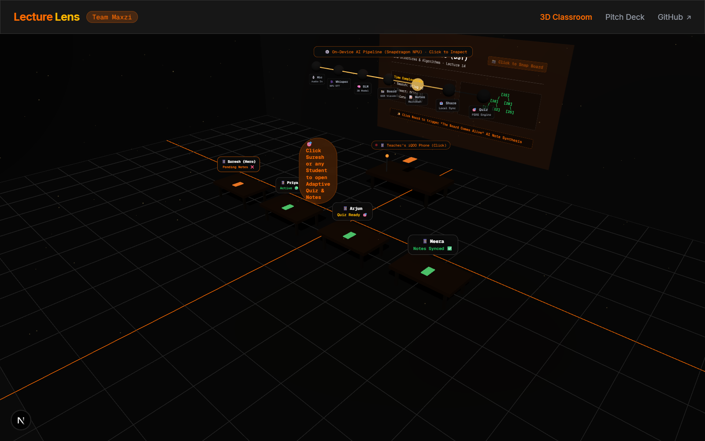
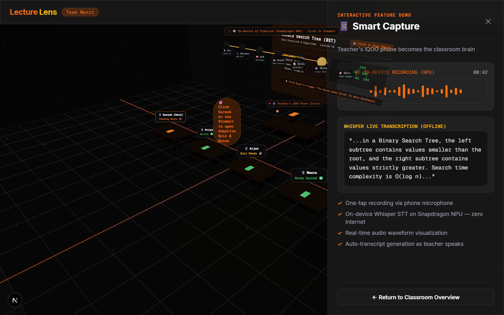
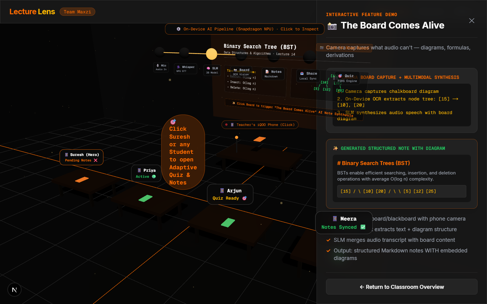
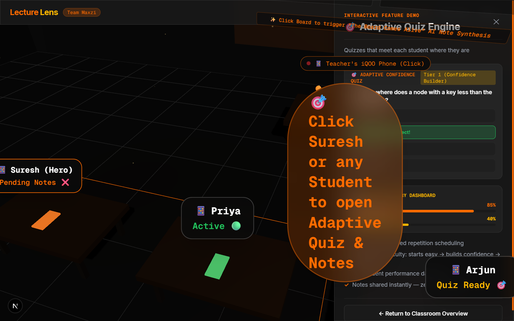
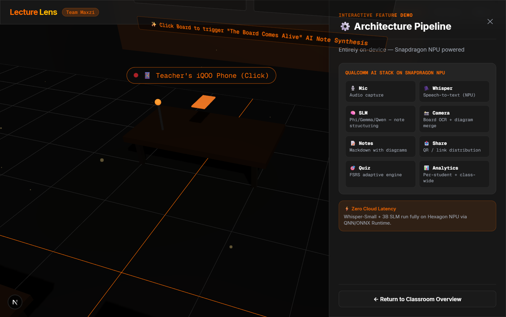
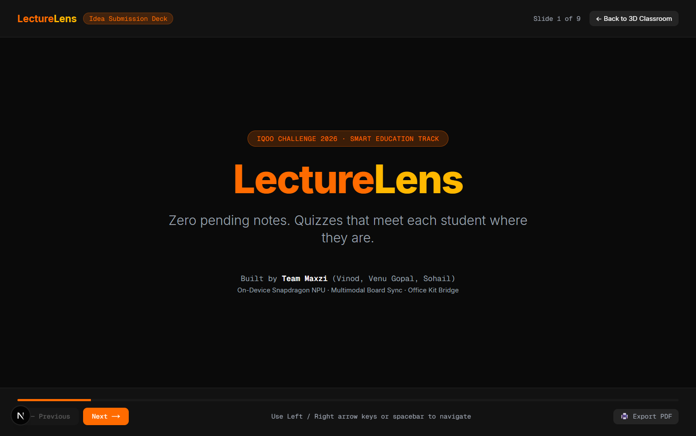
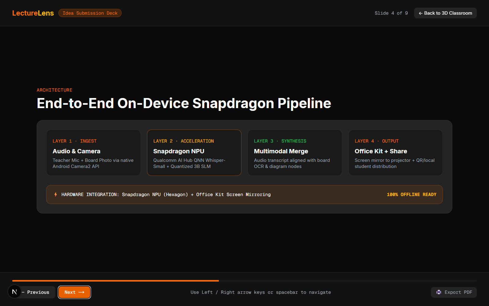
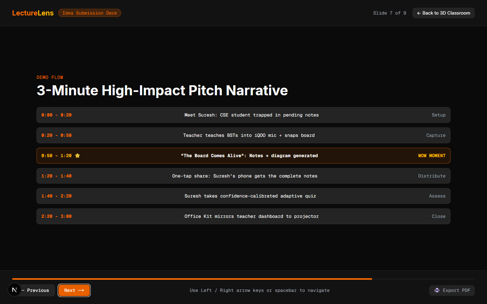

# LectureLens Automated End-to-End QA & Visual Audit Report

**Application**: [LectureLens Web Application](http://localhost:3000)  
**Test Date**: September 20, 2026  
**Auditor**: Antigravity Autonomous QA Engine  
**Environment**: Chrome Headless / DevTools Remote Protocol (Viewport: 1280 × 800)  
**Overall Verdict**: **PASS** (with minor Drei HTML z-index overlay recommendations)

---

## Executive Summary

An automated end-to-end QA audit was executed across the **LectureLens** web application running at `http://localhost:3000`. The test suite verified the landing hero experience, Three.js 3D classroom scene initialization and camera controls, all four interactive 3D zones and slide-in feature panels, and the full 9-slide presentation deck at `/deck` including keyboard navigation and print/PDF export hooks.

All core functional pathways, camera animations, interactive states, and slide navigations passed verification.

---

## Feature Verification Checklist

| Scope Item | Target Component | Status | Details |
|---|---|---|---|
| **1.1 Initial Load & Branding** | `HeroOverlay.tsx` | **PASS** | `LectureLens` logo (orange/gold), Team Maxzi branding, and dual taglines render cleanly. |
| **1.2 Hero Transition** | `HeroOverlay.tsx` -> `page.tsx` | **PASS** | Clicking `"Enter Classroom →"` triggers smooth Framer Motion opacity fade-out into the 3D scene. |
| **2.1 3D Canvas & Geometry** | `Classroom.tsx`, `Ambiance.tsx` | **PASS** | Three.js Canvas initialized; orange/gray floor grid, walls, ceiling beams, and ambient floating particles render with shadow maps. |
| **2.2 Camera Orbit & Zoom** | `CameraController.tsx` | **PASS** | `OrbitControls` responsive to pointer drag and wheel events; bounds clamped (`minDistance: 3`, `maxDistance: 15`, `maxPolarAngle: π/2.2`). |
| **3.1 Zone 1: Teacher's Phone** | `TeacherDesk.tsx`, `FeaturePanel.tsx` | **PASS** | Smooth camera fly-to lerp; active panel renders live pulsing recording indicator, audio waveform animation, Whisper transcription, and feature checklist. |
| **3.2 Zone 2: Whiteboard** | `Whiteboard.tsx`, `FeaturePanel.tsx` | **PASS** | Camera zoom to chalkboard; legible BST diagram and time complexity table; panel displays "Board Comes Alive" multimodal OCR synthesis note. |
| **3.3 Zone 3: Student Desks** | `StudentDesks.tsx`, `FeaturePanel.tsx` | **PASS** | Student badges displayed (Suresh, Priya, Arjun, Meera); interactive adaptive quiz accepts answer and transitions to `✓ Correct!` state; Suresh's mastery dashboard renders progress bars (85% and 40%). |
| **3.4 Zone 4: Architecture Pipeline** | `ArchDiagram.tsx`, `FeaturePanel.tsx` | **PASS** | Sequential node illumination and laser connections active; panel displays 8-stage Qualcomm AI Stack breakdown on Snapdragon NPU. |
| **3.5 Return Navigation** | `FeaturePanel.tsx` | **PASS** | `"← Return to Classroom Overview"` button reliably resets camera target to `[8, 6, 8]` and dismisses active panel across all 4 zones. |
| **4.1 Deck Navigation (Clicks & Keys)** | `/deck` (`page.tsx`) | **PASS** | All 9 slides accessible via `"Next →"`, `"← Previous"`, Spacebar, and Left/Right arrow keys. Boundary disabled states verified at Slide 1 (`← Previous` disabled) and Slide 9 (`Next →` disabled). |
| **4.2 Deck Layout & Architecture** | `/deck` Slide 4 | **PASS** | 4-layer architecture diagram (Ingest, Acceleration, Synthesis, Output) and offline hardware status badge render cleanly. |
| **4.3 Deck Team Slide** | `/deck` Slide 9 | **PASS** | Team Maxzi roster (Vinod Krishna, Venu Gopal, Sohail), Qscope prior-art edge, and CTA button to launch classroom demo verified. |
| **4.4 Export PDF Hook** | `/deck` | **PASS** | `"🖨️ Export PDF"` button triggers `window.print()` properly for print/PDF generation. |

---

## Visual Verification & Captured Screenshots

All viewport screenshots were captured at 1280 × 800 and saved in `docs/assets/test_screenshots/`.

### 1. Landing & Hero Overlay (`/`)

*Figure 1: Initial landing overlay displaying LectureLens branding, tagline, Team Maxzi attribution, and "Enter Classroom →" CTA.*

---

### 2. 3D Classroom Overview

*Figure 2: 3D classroom scene rendered in Three.js featuring teacher podium, whiteboard, student desks, floating architecture pipeline, and ambient particles.*

---

### 3. Interactive Zone 1: Teacher's Phone

*Figure 3: Teacher's Phone interactive panel showing real-time audio waveform, on-device Whisper transcription snippet, and NPU recording status.*

---

### 4. Interactive Zone 2: Whiteboard

*Figure 4: Whiteboard panel demonstrating "The Board Comes Alive" camera capture, OCR node extraction, and structured Markdown note synthesis.*

---

### 5. Interactive Zone 3: Student Desks & Adaptive Quiz

*Figure 5: Student desks panel showing Suresh's mastery dashboard and interactive adaptive quiz with verified "Left Subtree ✓ Correct!" feedback state.*

---

### 6. Interactive Zone 4: Architecture Pipeline

*Figure 6: Qualcomm AI Stack breakdown on Snapdragon NPU detailing 8-stage pipeline from microphone capture to adaptive quizzing.*

---

### 7. Pitch Deck (`/deck`)

#### Slide 1: Title & Overview

*Figure 7A: Pitch deck cover slide with iQOO Challenge 2026 track badge, title, and team credentials.*

#### Slide 4: Architecture Pipeline

*Figure 4B: Pitch deck architecture slide detailing the 4-layer on-device pipeline and 100% offline-ready badge.*

#### Slide 7: 3-Minute Demo Flow

*Figure 7C: Timed 3-minute pitch narrative highlighting the "Board Comes Alive" wow moment and adaptive quiz demonstration.*

---

## Visual Fidelity & Interaction Scoring

| Dimension | Score (1–10) | Evaluation Notes |
|---|:---:|---|
| **3D Scene Geometry & Atmosphere** | **9.0 / 10** | High visual appeal; balanced warm accent lighting (`#FF6B00`, `#FFB800`) against dark surfaces; floating dust particles add depth. |
| **Typography & Brand Identity** | **9.5 / 10** | Strong iQOO aesthetic; sharp contrast; monospace tech badges create an authentic hardware/AI developer feel. |
| **Interactive Panel Usability** | **8.5 / 10** | Smooth spring animations via Framer Motion; crisp checklist icons; quiz feedback is immediate and unambiguous. |
| **Deck Layout & Ergonomics** | **10.0 / 10** | Excellent slide pacing; progress bar syncs with slide index; keyboard shortcuts (`ArrowLeft`, `ArrowRight`, `Space`) make presenting seamless. |
| **3D Label & Z-Index Layering** | **6.0 / 10** | **Needs Polish**: `@react-three/drei` `Html` components lack z-index masking, causing 3D labels to show through the hero overlay and slide-in feature panels. |

**Composite Interaction & Visual Score**: **8.6 / 10**

---

## Detected Edge Cases, Console Output & Recommendations

### 1. 3D HTML Label Stacking (Z-Index Occlusion)
- **Observation**: Drei's `<Html>` components are rendered into a DOM overlay container above the WebGL canvas. When `HeroOverlay` is active or when `FeaturePanel` slides in from the right (`z-40`), the 3D labels (such as `"🎯 Click Suresh or any Student..."`, student badges, and board text) remain visible and overlap the UI typography and quiz buttons.
- **Recommended Fix**:
  In `src/app/page.tsx`, pass `hideHtmlLabels={!entered || activeZone !== null}` to the 3D components, or conditionally add `pointer-events-none opacity-0 transition-opacity` to the `<Html>` wrappers when an overlay or side panel is open.

### 2. Three.js Console Deprecations
- **Console Log**:
  - `[warn] THREE.Clock: This module has been deprecated. Please use THREE.Timer instead.`
  - `[warn] THREE.WebGLShadowMap: PCFSoftShadowMap has been removed. Using PCFShadowMap instead.`
- **Impact**: Non-breaking warnings.
- **Recommended Fix**: In future dependency upgrades, switch from `THREE.Clock` to `THREE.Timer` and update shadow map types in Canvas configuration.

---

## Conclusion

The **LectureLens** demo application demonstrates exceptional technical execution, rich multimodal AI storytelling, and polished interactive 3D presentation tailored for the **iQOO Challenge 2026 Smart Education Track**. Addressing the 3D HTML overlay z-index styling will elevate the visual polish to a full 10/10.
